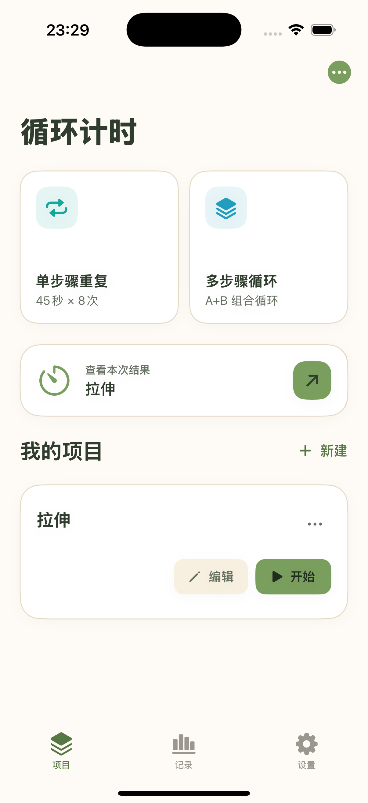
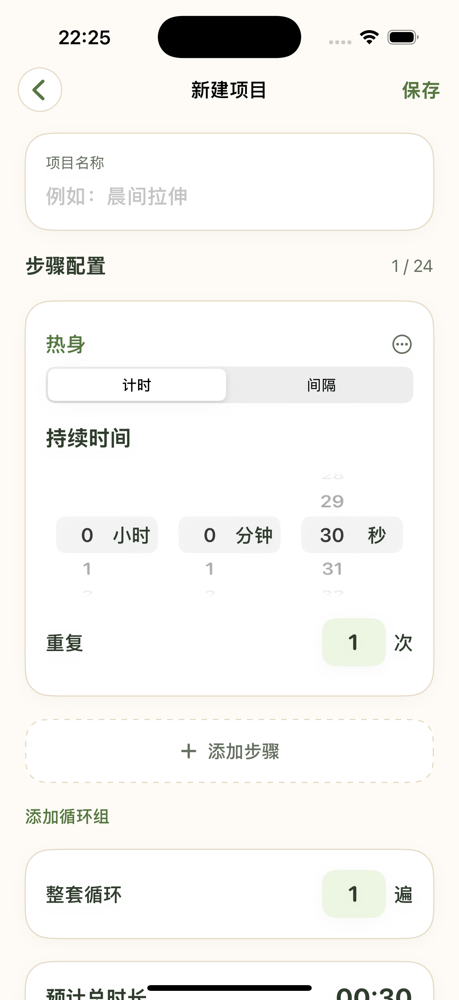
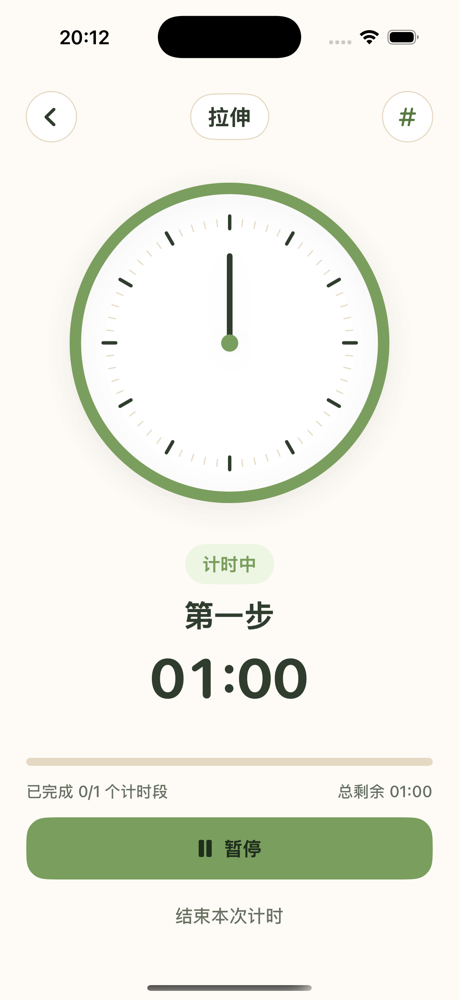

# 循环计时 · Cycle Timer

一款为运动、训练、学习等重复任务设计的计时器。可以把计时、休息和循环组排成一套流程，运行时查看当前进度，结束后回顾历史记录。

*A customizable interval timer for routines, workouts, and focused work.*

项目包含 **SwiftUI iPhone App** 和 **可添加到手机主屏幕的 PWA 网页版**。两套界面分别实现，使用相同的产品设计与计时规则。

[在线体验网页版](https://broken-bread-3760.cindywang904.workers.dev/)

<p align="center">
  
  
  
</p>

## 能做什么

- 快速开始单步骤重复或多步骤循环，也可以保存并管理自己的计时项目。
- 为每个步骤设置时长、重复次数和间隔；组合循环组与整套重复，并预览完整执行顺序。
- 在时钟和数字倒计时之间切换，暂停、继续或提前结束，查看完成统计与历史记录。
- 在网页端导出、导入本地备份；原生端支持本地通知提醒。

## 运行项目

| 版本 | 入口 | 本地运行 |
| --- | --- | --- |
| iPhone App | [`App/`](./App/) | 用 Xcode 打开 [`CycleTimer.xcodeproj`](./App/CycleTimer.xcodeproj)，选择 iPhone 模拟器运行。真机签名说明见 [App README](./App/README.md)。 |
| PWA 网页版 | [`Web/`](./Web/) | 在 `Web/` 目录运行 `python3 -m http.server 4173`，打开 `http://localhost:4173/`。部署说明见 [Web README](./Web/README.md)。 |

网页版无需框架或付费后端，`python3 Web/build.py` 可以生成静态部署文件。发布到 HTTPS 后，可通过 iPhone Safari 的“分享 → 添加到主屏幕”使用。

## 实现与边界

原生版使用 SwiftUI，计时规则与会话状态放在可单独测试的 Swift 核心中。网页版使用 HTML、CSS 和 JavaScript，计时流程由 `Web/core.js` 处理。项目、历史记录和运行状态保存在各自设备本地；两个版本之间不会自动同步。

网页版回到前台时会按实际经过时间校正倒计时。iOS 锁屏或浏览器退到后台时可能暂停网页，因此网页版无法保证锁屏时准点发声；对后台提醒有要求时请使用原生版，并在真机上检查通知权限、静音及专注模式。

## 验证与资料

```bash
cd App && swift test
cd ../Web
JSC_BIN=/System/Library/Frameworks/JavaScriptCore.framework/Versions/A/Helpers/jsc
"$JSC_BIN" -m tests.mjs && "$JSC_BIN" -m test-ui.mjs
python3 build.py
```

`jsc` 是 macOS 的 JavaScriptCore 命令行工具。产品构思与版本演进见 [PRD v0.3](./循环计时_PRD_v0.3.md)；视觉规则见 [DESIGN.md](./App/DESIGN.md)。构建缓存、部署 ZIP 和本机编辑器配置由 [`.gitignore`](./.gitignore) 排除。
